# ✈️ Sky Full of Freight
### Air Cargo Load Analysis & Airline Clustering — SFO (2000–2023)


---

## Background

I came across this dataset while digging into how airlines manage cargo operations alongside passenger services — something that doesn't get nearly as much attention as route pricing or seat utilization. What stood out immediately: belly cargo on commercial flights is a significant and often invisible revenue stream, yet capacity decisions are made with surprisingly limited visibility into cross-carrier patterns.

This project builds a full analytics pipeline on 24 years of SFO air cargo data — from raw cleaning through K-Means clustering — and surfaces the findings in a Power BI dashboard built for an operations or strategy audience.

The short answer to what I found: yes, distinct airline profiles exist, and the clustering tells a clean story.

---

## Dashboard Preview

> 📊 **[View Live Dashboard →](#)** *(add Power BI link after publishing)*

| Executive Overview | Regional Deep Dive | Cluster Intelligence |
|---|---|---|
| 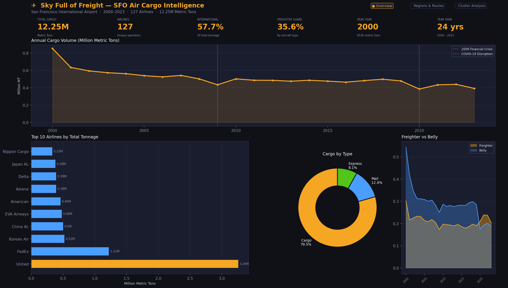 | 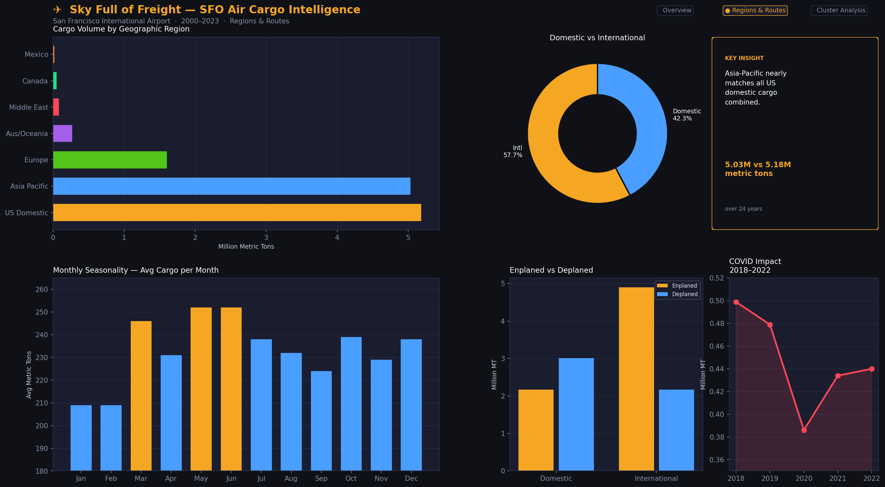 | 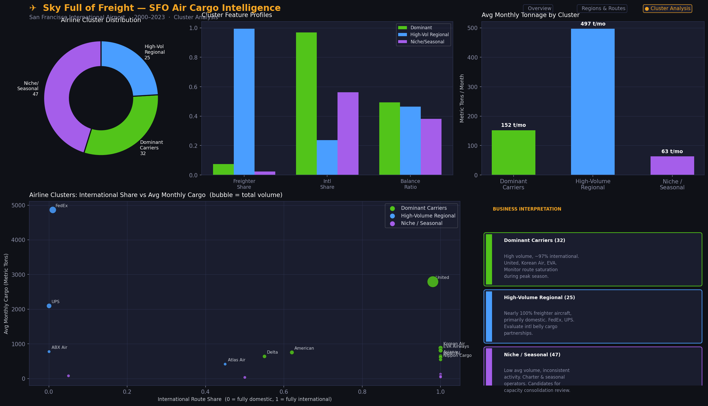 |

> 💡 Screenshots: Take them after building the Power BI dashboard and drop into `assets/`

---

## Dataset

**Air Traffic Cargo Statistics** — San Francisco International Airport (SFO)  
Source: [City & County of San Francisco Open Data Portal](https://data.sfgov.org/) via Kaggle

| Field | Detail |
|---|---|
| Period covered | July 1999 – September 2023 |
| Unique airlines | 130 |
| Total records | ~53,000 rows |
| Granularity | Airline × Month × Cargo Type × Aircraft Type × Direction |

Key columns: `Operating Airline`, `GEO Region`, `GEO Summary`, `Activity Type Code` (Enplaned/Deplaned), `Cargo Type Code` (Cargo/Mail/Express), `Cargo Aircraft Type` (Freighter/Passenger/Combi), `Cargo Weight LBS`, `Cargo Metric TONS`

---

## Project Structure

```
sky-full-of-freight/
│
├── data/
│   ├── Air_Traffic_Cargo_Statistics.csv     ← raw dataset (add manually — too large for git)
│   ├── cargo_cleaned.csv                    ← cleaned, date-parsed base
│   ├── cargo_master.csv                     ← enriched with cluster labels
│   ├── monthly_cargo_powerbi.csv            ← pre-aggregated for Power BI
│   └── airline_clusters.csv                ← airline-level features + K-Means result
│
├── notebooks/
│   └── analysis.py                          ← full pipeline: EDA + clustering + export
│
├── outputs/
│   ├── 01_cargo_trend.png
│   ├── 02_top_airlines.png
│   ├── 03_cargo_type_geo.png
│   ├── 04_seasonal_heatmap.png
│   ├── 05_freighter_vs_belly.png
│   ├── 06_elbow_silhouette.png
│   ├── 07_cluster_scatter.png
│   └── 08_cluster_profiles.png
│
├── powerbi_guide/
│   ├── POWERBI_GUIDE.md                     ← step-by-step dashboard build instructions
│   └── powerbi_theme.json                   ← custom dark theme (import into Power BI)
│
├── assets/                                  ← dashboard screenshots go here
├── requirements.txt
└── README.md
```

---

## Methodology

### Phase 1 — Data Cleaning
Parsed `Activity Period` (stored as integer YYYYMM) into proper year/month columns, converted date strings to datetime, filled ~578 missing IATA codes, and filtered to post-2000 records for statistical consistency. Exported clean base CSV for downstream steps.

### Phase 2 — Exploratory Analysis

Key findings from EDA:

- **57.7% of cargo is international** — SFO's trans-Pacific position means Asia-Pacific alone nearly matches all US domestic tonnage (5.03M vs 5.18M metric tons over 24 years)
- **The 2020 COVID shock is the sharpest single-year drop** in the dataset, but cargo recovered faster than passengers — freighter operations expanded to partially compensate for lost belly capacity
- **October–December seasonality is consistent** across years, reflecting pre-holiday e-commerce and retail inventory cycles
- **Top 3 carriers** (United, FedEx, Korean Air) account for a disproportionate share of total tonnage across 127 airlines

### Phase 3 — Clustering

Built airline-level features for K-Means clustering:

| Feature | Description |
|---|---|
| `Avg_Monthly_Tons` | Average monthly cargo tonnage per airline |
| `Freighter_Share` | Fraction of records using dedicated freighter aircraft |
| `Intl_Share` | Fraction of routes that are international |
| `Balance_Ratio` | Enplaned ÷ total cargo (0.5 = perfectly directionally balanced) |

Used StandardScaler + K-Means with **K=4**, validated via WCSS elbow curve and silhouette score. Three operationally distinct profiles emerged:

| Cluster | Airlines | Profile |
|---|---|---|
| **Dominant Carriers** | 32 | High volume, ~97% international, mix of belly and freighter. United, Korean Air, EVA, Asiana. |
| **High-Volume Regional** | 25 | ~99% freighter aircraft, primarily domestic. FedEx, UPS, ABX Air. Specialized in express. |
| **Niche / Seasonal Operators** | 47 | Low average volume, inconsistent activity periods. Charter, seasonal, defunct carriers. |

### Phase 4 — Power BI Dashboard

Three-page dashboard built against the exported CSVs:

- **Page 1 — Executive Overview**: KPI cards, 24-year volume trend with crisis annotations, top 10 airline bar chart, cargo type donut
- **Page 2 — Regional Deep Dive**: GEO region breakdown, monthly seasonality, enplaned vs. deplaned by region, COVID impact zoom
- **Page 3 — Cluster Intelligence**: Scatter plot with cluster overlays, feature comparison bars, business interpretation panel

See `powerbi_guide/POWERBI_GUIDE.md` for the full build walkthrough.

---

## Key Findings

1. **Asia-Pacific rivals domestic US cargo** despite being a single international region — driven by SFO's trans-Pacific hub position and carriers like Korean Air, EVA Airways, and Asiana.

2. **COVID caused the sharpest single-year decline** in 24 years (2020), but dedicated freighter capacity expanded to absorb part of the lost belly cargo — partially visible in the aircraft type trend chart.

3. **Express freight (FedEx, UPS) is only 8% of tonnage** but represents the highest revenue-per-kg segment and operates almost entirely on dedicated freighters with near-zero international routing from SFO.

4. **The clustering cleanly separates** dedicated cargo operators from passenger carriers — the freighter share feature alone does most of the separation work between clusters 1 and 2.

5. **47 airlines in the Niche/Seasonal cluster** average just 63 metric tons/month — first candidates for capacity partnership or route consolidation analysis.

---

## Business Implications

- Airlines with low directional balance ratios (heavily enplaned or deplaned) may benefit from cargo partnership agreements to improve utilization on return legs.
- The COVID period shows that when passenger belly capacity collapses, dedicated freighters do not fully compensate — a meaningful tonnage gap remained at the trough.
- Consistent Oct–Dec seasonality across years is stable enough to support pre-committed capacity planning for Dominant and High-Volume carriers.

---

## EDA Charts

<details>
<summary>Click to expand all 8 charts</summary>

**01 — Annual Cargo Volume Trend**  
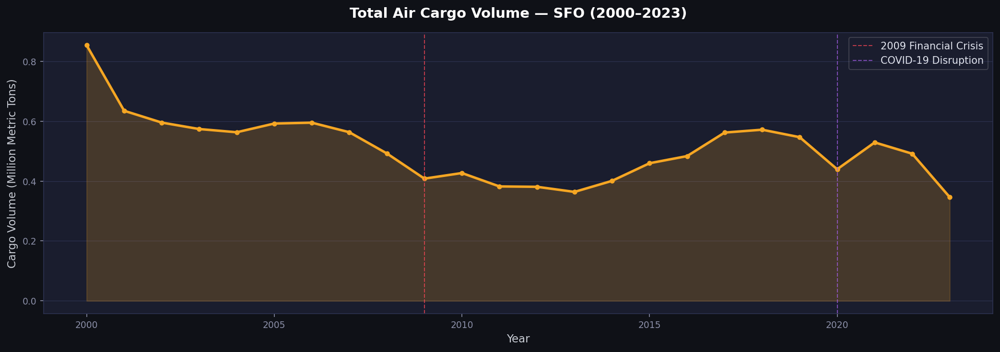

**02 — Top 15 Airlines by Total Tonnage**  
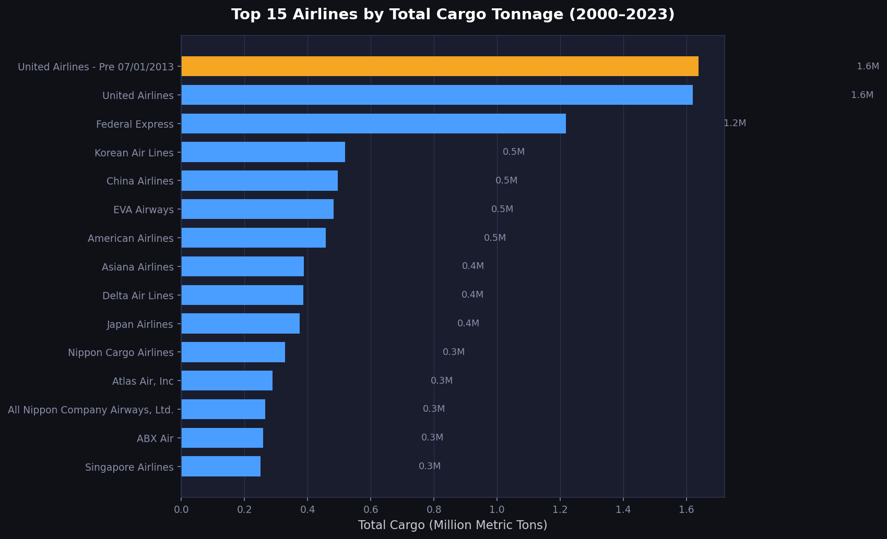

**03 — Cargo Type & GEO Region Split**  
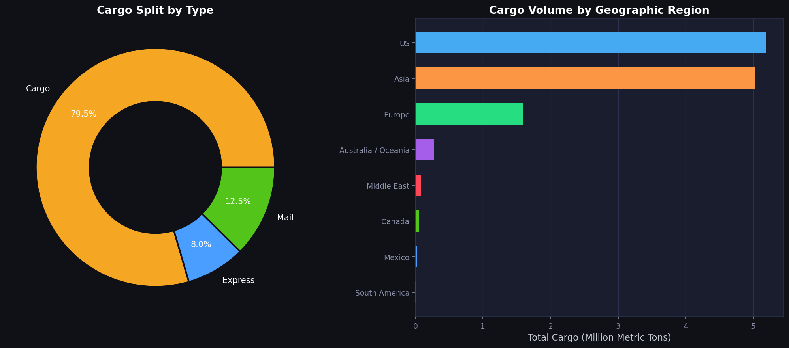

**04 — Monthly Seasonality Heatmap**  
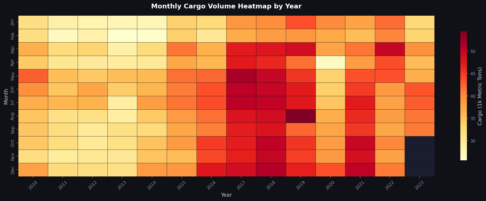

**05 — Freighter vs Passenger Belly vs Combi**  
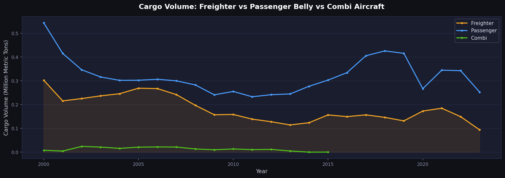

**06 — K-Means Elbow & Silhouette Curves**  
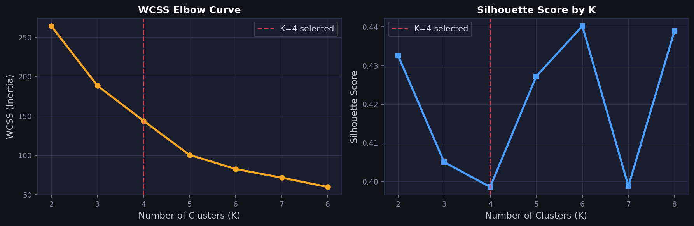

**07 — Airline Cluster Scatter Plot**  
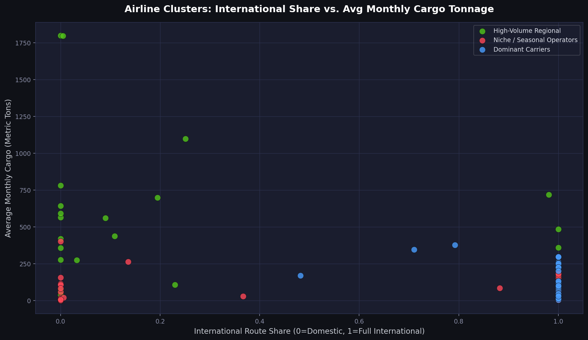

**08 — Cluster Feature Profiles**  
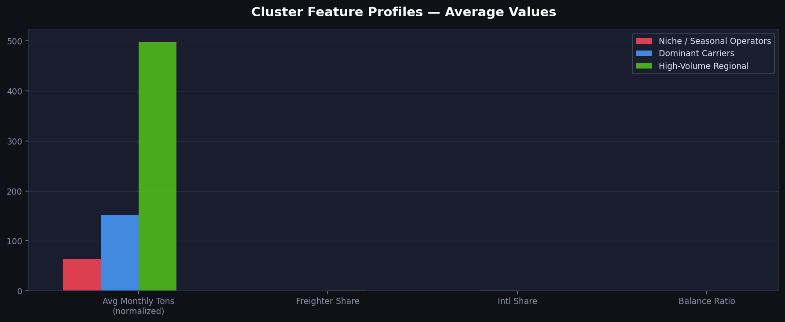

</details>

---

## Running the Analysis

```bash
# 1. Clone the repo
git clone https://github.com/Krishhh2410/sky-full-of-freight.git
cd sky-full-of-freight

# 2. Install dependencies
pip install -r requirements.txt

# 3. Add the raw dataset
# Download from: https://www.kaggle.com/datasets/amitvkulkarni/air-traffic-cargo-statistics
# Place at: data/Air_Traffic_Cargo_Statistics.csv

# 4. Run the pipeline
cd notebooks
python analysis.py

# Outputs written to ../outputs/ and ../data/
```

---

## Stack

| Layer | Tools |
|---|---|
| Data wrangling | Python, pandas, NumPy |
| Visualization | Matplotlib, Seaborn |
| Machine learning | scikit-learn (KMeans, StandardScaler, silhouette_score) |
| BI Dashboard | Power BI Desktop (custom DAX, dark theme) |

---

## Author

**Krish Shah**  
B.Tech Computer Science Engineering — Nirma University, Ahmedabad (2023–2027)  
[GitHub](https://github.com/Krishhh2410) · [LinkedIn](#) *(add your link)*

---

## License

MIT — free to use, fork, and build on.
